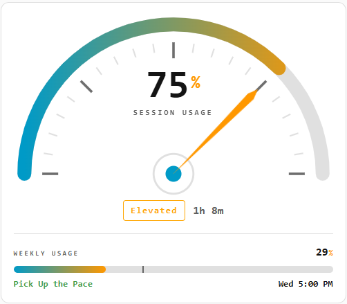

# Claude Usage Gauge Card

A custom Lovelace card for Home Assistant that shows Claude usage as a themed
semicircle needle gauge, with the session percentage inside the arc and a
weekly usage bar below it that includes straight-line pacing.

The card reads its colors from your active Home Assistant theme, so it fits
light and dark dashboards without any color configuration.



## Features

- Needle gauge with gradient arc, tick marks, and a status band
  (Nominal / Elevated / High Load / Critical)
- Session percentage and label rendered inside the arc
- Session reset line with a friendly idle message when no session is active
- Weekly usage bar bound to a separate sensor
- Weekly pacing: a marker on the bar shows where you *should* be if usage were
  spread evenly across the week, plus a plain-language message
  (Well under pace / Under pace / On pace / Over pace / Well over pace)
- Fully themeable, with a visual editor for every option

## Installation (HACS)

1. In Home Assistant, go to **HACS**.
2. Open the three-dot menu in the top right and choose **Custom repositories**.
3. Paste this repository's URL, set the category to **Dashboard**, and add it.
4. Find **Claude Usage Gauge Card** in the list and click **Download**.
5. Reload your browser (a hard refresh clears the old cache).

HACS registers the dashboard resource automatically. You do **not** need to add
it manually under Settings → Dashboards → Resources.

## Adding the card

In your dashboard, add a manual card:

```yaml
type: custom:claude-usage-gauge-card
entity: sensor.claude_session_usage
label: Claude Usage
reset_attribute: session_resets_in
weekly_entity: sensor.claude_weekly_usage
weekly_reset_entity: sensor.claude_weekly_resets
weekly_period_days: 7
```

Or use the visual editor, which exposes every option below.

## Configuration

### Core

| Option | Default | Description |
|---|---|---|
| `entity` | (required) | Session usage sensor, expected to report 0–100. |
| `label` | `Claude Usage` | Text shown under the big number, inside the arc. |
| `reset_attribute` | (none) | Attribute on the session entity holding the reset time. |
| `idle_text` | `No active session` | Shown when the reset attribute is unknown or blank. |
| `decimals` | `0` | Decimal places on the session number. |
| `card_height` | `380` | Maximum gauge height in pixels. |

### Weekly usage bar

The weekly section only appears when `weekly_entity` is set.

| Option | Default | Description |
|---|---|---|
| `weekly_entity` | (none) | Weekly usage sensor, expected to report 0–100. |
| `weekly_label` | `Weekly Usage` | Label above the bar. |
| `weekly_reset_entity` | (none) | Separate sensor holding the weekly reset time. |
| `weekly_period_days` | `7` | Length of the weekly window, used for pacing. |

The reset sensor can report a countdown (`4d 12h`), a weekday and time
(`Wed 4:59 PM`), a bare time (`4:59 PM`), or a full timestamp. The card figures
out the time remaining either way.

### Pacing messages

Pacing compares your actual weekly usage to the straight-line expected usage
for this point in the week. The message is driven by the gap between the two,
measured in percentage points.

| Option | Default | Description |
|---|---|---|
| `pace_band_minor` | `3` | Within this many points of expected reads as "on pace". |
| `pace_band_major` | `10` | Beyond this many points reads as "well over/under". |
| `label_pace_under_major` | `Well under pace` | More than `pace_band_major` under. |
| `label_pace_under` | `Under pace` | Between minor and major, under. |
| `label_pace_on` | `On pace` | Within `pace_band_minor` either way. |
| `label_pace_over` | `Over pace` | Between minor and major, over. |
| `label_pace_over_major` | `Well over pace` | More than `pace_band_major` over. |

Hover the pace message to see the exact numbers behind it.

### Status band (session)

| Option | Default | Description |
|---|---|---|
| `band_elevated` | `40` | Threshold for the Elevated band. |
| `band_high` | `75` | Threshold for the High Load band. |
| `band_critical` | `92` | Threshold for the Critical band. |
| `label_nominal` | `Nominal` | Label below the Elevated threshold. |
| `label_elevated` | `Elevated` | |
| `label_high` | `High Load` | |
| `label_critical` | `Critical` | |

## Updating

Updates are managed through HACS. When a new release is published here, HACS
shows an update prompt on the card and pulls it in one click. There is no need
to edit files in `/config/www` or bump a version query string by hand.

## License

MIT
